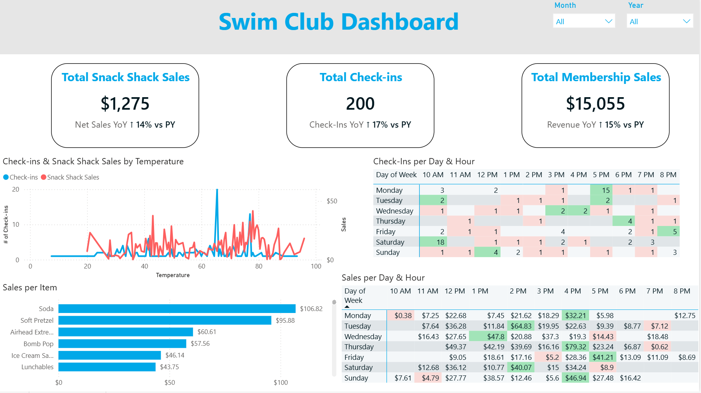
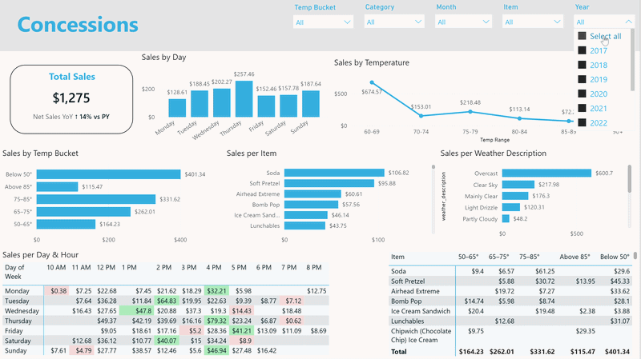
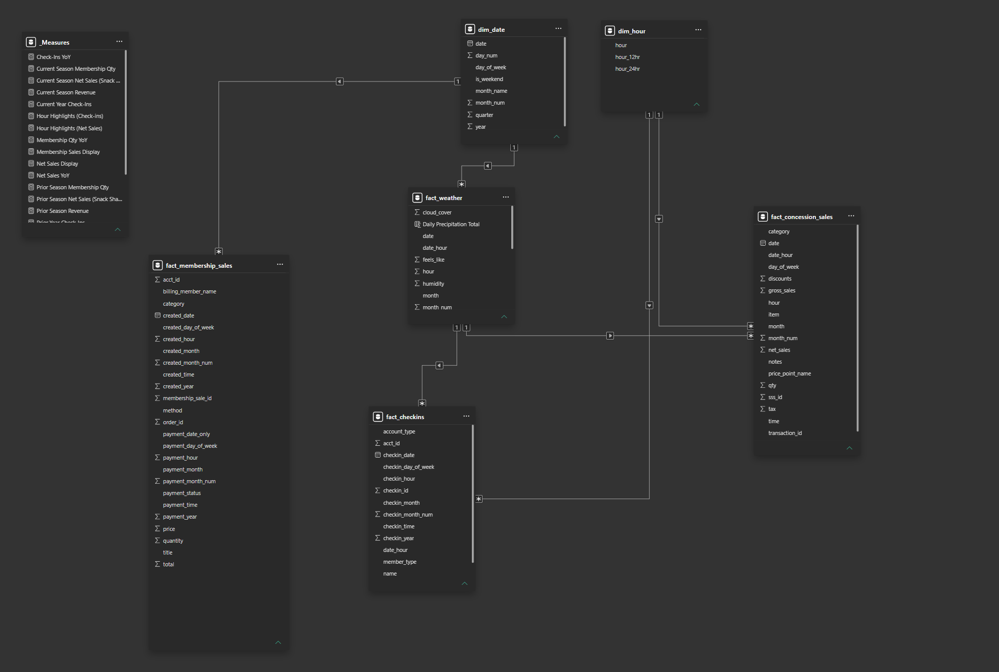
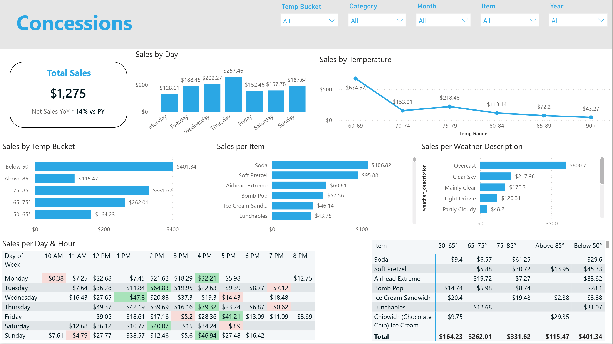
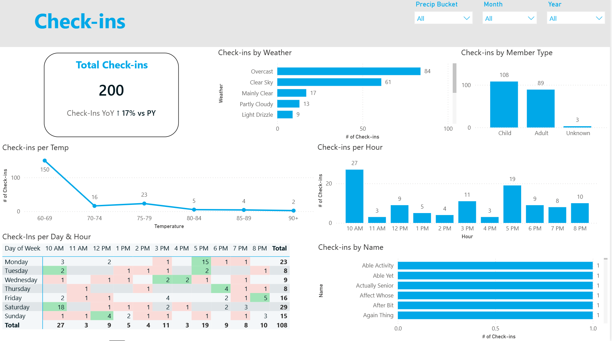
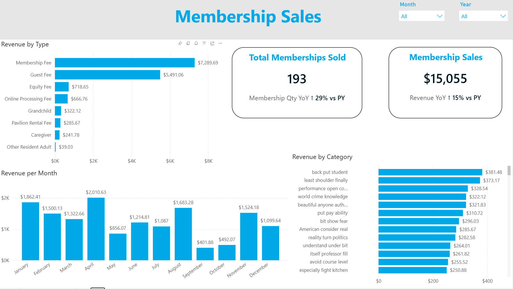

# Pool-Analytics-Dashboard



## Executive Summary
An end-to-end analytics solution built to unify transactional data across facility management systems, POS software, and local weather history. By centralizing raw data from MemberSplash and Square via a Python ETL pipeline, this project delivers actionable operational intelligence to maximize pool attendance and concession revenue.

> **Note on this repository:** The original project loads data into a Supabase (PostgreSQL) database that Power BI connects to directly. This public repo version simplifies that step — the ETL pipeline outputs cleaned CSVs (in `cleaned_data/`) instead of connecting to a live database, so anyone cloning this repo can run it without needing their own Supabase instance.

> **Note on data:** This is a public repository, so the underlying data has been synthetically regenerated to protect member and business privacy. The statistical relationships (correlations, seasonal trends, lift percentages) are preserved from the original analysis performed for a real regional swim club.



## Table of Contents
- [Key Business Insights & Recommendations](#key-business-insights--recommendations)
- [Tech Stack & Architecture](#tech-stack--architecture)
- [Data Pipeline Architecture](#data-pipeline-architecture)
- [Power BI Data Model](#power-bi-data-model-star-schema)
- [Dashboard Visualizations](#dashboard-visualizations)
- [Repository Structure](#repository-structure)
- [How to Run Locally](#how-to-run-locally)
- [Future Improvements](#future-improvements)
- [About This Project](#about-this-project)

## Key Business Insights & Recommendations
* **Check-ins Are the Strongest Predictor of Revenue (r = 0.83):** Statistical analysis revealed that facility check-ins are the strongest observed predictor of concession sales, outperforming pure weather metrics (e.g., temperature/heat index).
  * *Recommendation:* Focus marketing strategies on driving member & guest check-ins. Implement a "Loyalty Perk" (e.g., *Visit 10 times, get 15% off at the Snack Shack*) to incentivize repeat visits.
* **Food Truck Non-Cannibalization (+27% Attendance):** Historical event analysis showed that bringing external food trucks to the facility was associated with a **27% net increase in overall pool check-ins**, without cannibalizing native concession sales — yielding a net positive revenue impact.
  * *Recommendation:* Expand the number of food truck events given the sizable uptick in attendance, which drives both food truck sales and concession sales.
* **Inventory Stockout & Bundling Strategy:** Leveraged domain experience (lifeguard operations) alongside item-level sales distribution to identify consistent stockouts on top-selling concession items.
  * *Recommendation:* Expand capacity of top-selling items (soft pretzels) to meet current demand and reduce sales lost to stockouts.

## Tech Stack & Architecture

* **Data Extraction & Ingestion:** Manually extracted raw, unformatted CSV exports from **MemberSplash** (membership/check-ins) and **Square POS** (concessions).
* **ETL Pipeline (Python/Pandas):**
  * Cleaned messy text, standardized irregular time formats, and calculated derived fields.
  * Fetched historical hourly weather data via the **Open-Meteo API** (temperature, precipitation, wind speed, feels-like calculations).
  * Outputs cleaned, structured CSVs to `cleaned_data/` for the dashboard to read directly.
* **Semantic Modeling & Visualization (Power BI):** Loads the cleaned CSVs to build a Star Schema model, complete with custom DAX time-intelligence measures (YoY seasonal growth).
> In the original production version of this project, the pipeline upserts directly into a Supabase (PostgreSQL) database that Power BI connects to live. This repo simplifies that step to local CSVs so it can be run without a database.

## Data Pipeline Architecture
```
[ MemberSplash CSVs ] ──┐
[ Square POS CSVs   ] ──┼─> [ Python ETL Script ] ──> [ Open-Meteo API ]
                        │          │
                        │          v
                        └──> [ Cleaned CSVs ] ──> [ Power BI Dashboard ]
```

## Power BI Data Model (Star Schema)



* **Star Schema Architecture:** Centered around three core transactional fact tables (`fact_membership_sales`, `fact_checkins`, `fact_concession_sales`) and an hourly log (`fact_weather`).
* **Conformed Dimensions:** Shared dimension tables (`dim_date`, `dim_hour`) filter multiple fact tables simultaneously via single-direction `1:*` relationships, ensuring strict data integrity and performant cross-filtering.
* **Dedicated Measure Table:** Implemented an isolated `_Measures` table to store all DAX calculations (YoY growth, moving averages, period comparisons) for clean model organization.

---

## Dashboard Visualizations

### 1. Executive Overview

Top-line KPIs — total snack shack sales, total check-ins, and total membership sales — each with a YoY comparison callout. Below that, a dual-axis chart overlays check-ins and snack shack sales against temperature to visualize the relationship, alongside a day/hour matrix for both check-ins and sales and an item-level sales breakdown.

### 2. Concession & Inventory Performance

Total sales KPI with YoY growth, plus sales broken out by day of week, temperature, temperature bucket, item, and weather description. A day-by-hour sales matrix highlights peak and low sales windows (conditional formatting flags high/low cells), and an item-by-temperature-bucket table shows which products sell best under which conditions — the data behind the stockout/bundling recommendation above.

### 3. Check-In & Attendance Analytics

Total check-ins KPI with YoY growth, plus check-ins broken out by weather condition, member type (child/adult/unknown), temperature, and hour of day. A day-by-hour matrix shows peak attendance windows (Saturday mornings stand out).

### 4. Membership Sale Analysis

Total memberships sold and total membership revenue KPIs, each with YoY growth. Revenue is broken out by membership/fee type (membership fee, guest fee, equity fee, etc.) and by month, showing clear seasonal peaks around April and the summer months.

---

## Repository Structure
```
Pool-Analytics-Dashboard/
├── scripts/               # Python ETL scripts (extraction, cleaning, weather API)
├── raw_fake_data/         # Synthetically regenerated source CSVs (MemberSplash, Square, weather)
├── cleaned_data/          # Cleaned/processed output from the ETL pipeline
├── dashboard/             # Power BI (.pbix) dashboard file
├── docs/                  # Dashboard screenshots used in this README
├── requirements.txt       # Python dependencies
├── .gitignore
├── .gitattributes
├── LICENSE.txt
└── README.md
```

## Tech Stack & Dependencies

* **Language:** Python 3.13
* **ETL Libraries:** `pandas`, `numpy`, `requests`, `python-dateutil`, `openpyxl`
* **Database & Storage:** CSV (Supabase/PostgreSQL used in the original production version, not required to run this repo)
* **Business Intelligence:** Power BI Desktop (DAX, Power Query)

---

## How to Run Locally

1. **Clone the repository:**
   ```bash
   git clone https://github.com/natey/Pool-Analytics-Dashboard.git
   cd Pool-Analytics-Dashboard
   ```

2. **Install dependencies:**
   ```bash
   pip install -r requirements.txt
   ```

3. **Run the ETL pipeline:**
   ```bash
   python scripts/pool_data_etl_script.py
   ```

4. **Open the Power BI dashboard:**
   Open `dashboard/pool_data_analysis.pbix` in Power BI Desktop. It reads directly from the CSVs in `cleaned_data/` — no database connection required.

## Future Improvements
- **Automate ingestion:** Replace manual CSV exports from MemberSplash/Square with a scheduled API pull or scraper to eliminate manual extraction steps.
- **Predictive modeling:** Layer in a forecasting model (e.g., attendance prediction based on weather + day-of-week) to move from descriptive to predictive analytics.
- **Real-time refresh:** Migrate from manual/scheduled Power BI refresh to a streaming or near-real-time pipeline for same-day operational decisions.

## About This Project
This project was built to analyze 4+ seasons of real attendance, sales, and weather data for a regional swim club, with findings and strategy recommendations presented directly to the club's executive board. Underlying data in this public repository has been synthetically regenerated to protect member and business privacy — statistical relationships (correlations, seasonal trends, lift percentages) are preserved from the original analysis.

Built by Nate Yohn — Information Systems & Analytics student at Shippensburg University.
📧 nate.m.yohn@gmail.com | [LinkedIn](https://www.linkedin.com/in/nate-yohn-54763524a/)

## License
This project is licensed under the MIT License — see the `LICENSE.txt` file for details.